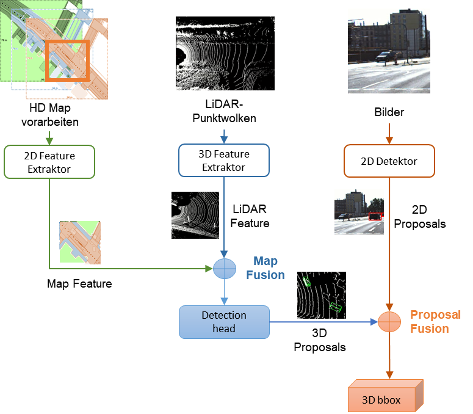
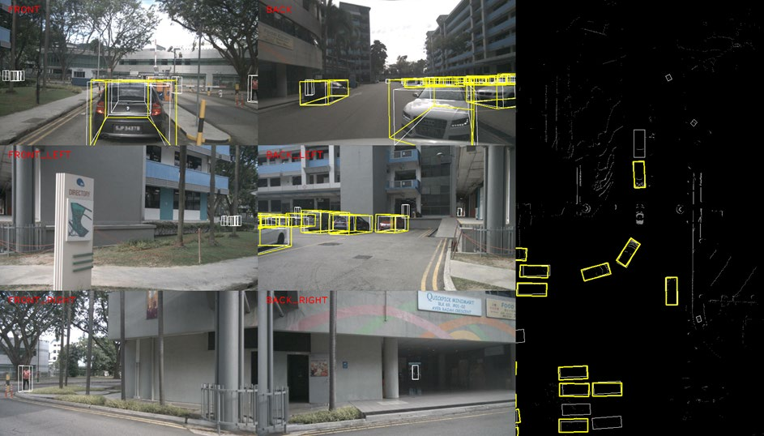

## Camera LiDAR Map Fusion Model

This repository contains the public release of my Master Thesis : the python implementation of Camera-LiDAR-Map-Fusionmodel network for 3D object detection.

If you use this code, please cite as follows:

```
@mastersthesis{SYang2022,
  author       = {Shilu Yang}, 
  title        = {Implementation of a machine learning algorithm for heterogeneous data},
  school       = {University of Stuttgart},
  year         = 2022,
  month        = 7
}
```
###  Introduction
The Camera-LiDAR-Map-Fusionmodel is a multi-modal 3D detection network, which contains one feature extraction stage and two fusion stages: a) Feature Extraction: Using the OpenPCDet and MMDetection codebases assures a modular framework, allowing for support of a variety of popular 2D and 3D feature extractors as well as 3D datasets. b) Fist Fusion (MapFusion): feature-level LiDAR and map data fusion. c) Second Fusion (Proposal Fusion): late fusion of camera 2D proposals with LiDAR 3D proposals. The experiment on a subset nuScenes dataset showed that, as compared to the baseline SOTA 3D detector in 2021 (CenterPoint), the MapFusion model improves accuracy by 2.4% mAP, while the usage of the Late Fusion improves precision by 5.7% mAP. Aside from that, the outcomes on the KITTI dataset and the self-built Robotino dataset showed similar accuracy enhancement performance. These results suggest that the Camera-LiDAR-Map-Fusionmodel is a feasible fusion model for 3D object detection, with good usability and extensibility.

###  Results


#### a. Camera, LiDAR, Map Fusion on nuScenes Subset
```
Baseline: CenterPoint + YOLOX
Car detection

Model        AP@0.5  1.0     2.0     4.0     mean    Improvement
Baseline     53.31   65.24   72.21   74.50   66.32   0.00
MapFusion    54.52   68.14   74.89   77.26   68.70   2.38
Late Fusion  59.35   74.01   81.15   82.82   74.33   8.02
             ATE     ASE     AOE     AVE     AAE     NDS
Baseline     0.2510  0.1850  0.3040  0.6170  0.2430  0.6716
MapFusion    0.2570  0.1860  0.2870  0.7110  0.2510  0.6743
Late Fusion  0.2580  0.1830  0.3110  0.7370  0.2580  0.6970
```
#### b. Camera, LiDAR Fusion on KITTI
```
Baseline: Second + YOLOX
Car AP_R40 @0.70 0.70 0.70

Benchmark            Easy          Moderate         Hard
bbox AP@0.70    96.83 / 95.42   91.16 / 89.21   88.24 / 88.03
bev AP@0.70     93.60 / 93.46   87.23 / 86.58   84.16 / 84.27
3d AP@0.70      86.48 / 84.08   74.24 / 72.04   70.78 / 68.83
aos AP          96.76 / 95.35   90.90 / 88.98   87.85 / 87.65
```
#### c. Camera, LiDAR Fusion on Robotino Dataset
```
Baseline: PointPillar + EfficientDet
Robotino AP_R40@0.70, 0.70, 0.70    /   Robotino AP_R40@0.70, 0.50, 0.50 

Benchmark       Overlap_0.7     Benchmark       Overlap_0.5
bbox AP@0.70   77.45 / 74.82   bbox AP@0.70   77.45 / 74.82
bev AP@0.70    38.83 / 35.61   bev AP@0.50    42.11 / 38.78
3d AP@0.70     31.25 / 31.43   3d AP@0.50     42.11 / 38.78
aos AP         66.42 / 61.48   aos AP         66.42 / 61.48
```

###  1. centerpoint-maps

This repository is the implementation of the LiDAR-Camera-Map Fusion Model on [nuScenes](https://www.nuscenes.org/) dataset, with baseline 3D detector [Centerpoint](https://arxiv.org/abs/2006.11275).

**Codebase:** [Centerpoint](https://github.com/tianweiy/CenterPoint) <br>

###  2. OpenPCDet

This is the implementation of late fusion model [CLOCs](https://github.com/pangsu0613/CLOCs) on [KITTI](http://www.cvlibs.net/datasets/kitti/) and Robotino dataset, with baseline 3D detector [SECOND](https://pdfs.semanticscholar.org/5125/a16039cabc6320c908a4764f32596e018ad3.pdf) and [PointPillars](https://arxiv.org/abs/1812.05784).

**Codebase:** [OpenPCDet](https://github.com/open-mmlab/OpenPCDet) <br>

###  3. mmdetection

This is the repository we used for 2D detector (YOLOX, Cascade RCNN, YOLOV3) training. <br>

It is forked from [open-mmlab / mmdetection](https://github.com/open-mmlab/mmdetection), we have implemented KITTI dataset in the corresponding trainable 2D dataset format. For the training with nuScenes and Robotino, just follow the COCO format.<br>

The used SOTA detector [EfficientDet](mmdetection/efficientDet/readme.md) is also included.<br>

For the use of mmdetection, please follow the [official tutorial](https://github.com/open-mmlab/mmdetection/blob/master/demo/MMDet_Tutorial.ipynb). It is also OK to use the newest version from official repo.

### Reference for Fusion Models:
[MapFusion: A General Framework for 3D Object Detection with HDMaps](https://arxiv.org/abs/2103.05929) <br>
[CLOCs: Camera-LiDAR Object Candidates Fusion for 3D Object Detection](https://arxiv.org/abs/2009.00784) <br>
[Leveraging HD Maps for 3d Object Detection](https://github.com/mon95/centerpoint-maps/blob/master/ACV_Project_FinalReport.pdf)